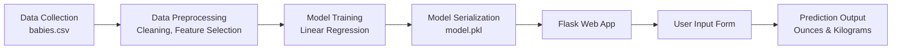

# 👶🏼 Birth Weight Predictor ⚖️

A modern, interactive web application that predicts the birth weight of a baby using maternal and pregnancy-related data. Built with Flask, Python, and a machine learning model (Linear Regression), this project demonstrates the end-to-end workflow of a data science solution, from data preprocessing to deployment.

---

## 🚀 Features
- Clean, responsive, and animated UI
- Multi-page navigation: Home, Prediction, About
- Detailed tooltips, input validation, and help texts
- Instant prediction of birth weight in ounces and kilograms
- Project, model, and API documentation

---

## 📝 Project Description
This project showcases how machine learning can be applied to real-world health data. Users can enter pregnancy and maternal details, and the app predicts the expected birth weight of the child. The model is trained on real birth data and is intended for educational and demonstration purposes.

---


## 🔄 Workflow
1. **Data Collection & Preprocessing**: Clean and prepare the birth dataset for modeling.
2. **Model Training**: Train a Linear Regression model to predict birth weight.
3. **Model Serialization**: Save the trained model as a `.pkl` file.
4. **Web App Development**: Build a Flask app with interactive, multi-page UI.
5. **Deployment**: Run the app locally or deploy to a cloud platform.

### 📊 Visual Workflow



---

## 🖥️ App Structure
```
├── app.py                # Flask backend
├── model_training.ipynb  # Model training notebook
├── model/
│   └── linear_regression_model.pkl
├── dataset/
│   └── babies.csv
├── templates/
│   ├── home.html
│   ├── predict.html
│   └── about.html
├── requirements.txt
└── .gitignore
```

---

## 📊 Data Input
| Field      | Description                                      | Example | Range         |
|------------|--------------------------------------------------|---------|--------------|
| gestation  | Length of pregnancy in days                      | 280     | 200 - 320    |
| parity     | Is this the first pregnancy? (0=Yes, 1=No)       | 0       | 0 or 1       |
| age        | Mother's age in years                            | 28      | 15 - 50      |
| height     | Mother's height in inches                        | 65      | 50 - 80      |
| weight     | Mother's weight in pounds                        | 140     | 90 - 300     |
| smoke      | Does the mother smoke? (0=No, 1=Yes)             | 0       | 0 or 1       |

---

## 🔗 API Usage
### Endpoint
`POST /predict`

### Request Example
```
{
  "gestation": 280,
  "parity": 0,
  "age": 28,
  "height": 65,
  "weight": 140,
  "smoke": 0
}
```

### Response Example
```
{
  "predicted_birth_weight": 120
}
```

---

## 📈 Model Details
- **Algorithm**: Linear Regression
- **Performance**: R² Score ≈ 0.78, Mean Absolute Error ≈ 250 grams
- **Output**: Birth weight in ounces (and kilograms)

---

## 🌐 How to Run
1. Clone the repository
2. Install dependencies: `pip install -r requirements.txt`
3. Run the app: `python app.py`
4. Open your browser at `http://localhost:5000`

---

## 👤 About
Created by Your Name — Data Science Enthusiast

---

## 📸 Screenshots
> Add screenshots of the Home, Prediction, and About pages here for a more visual README!

---

## 📄 License
This project is for educational purposes only.
